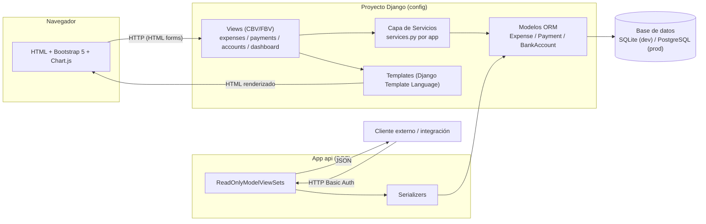
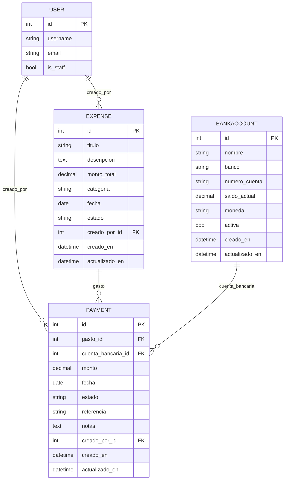
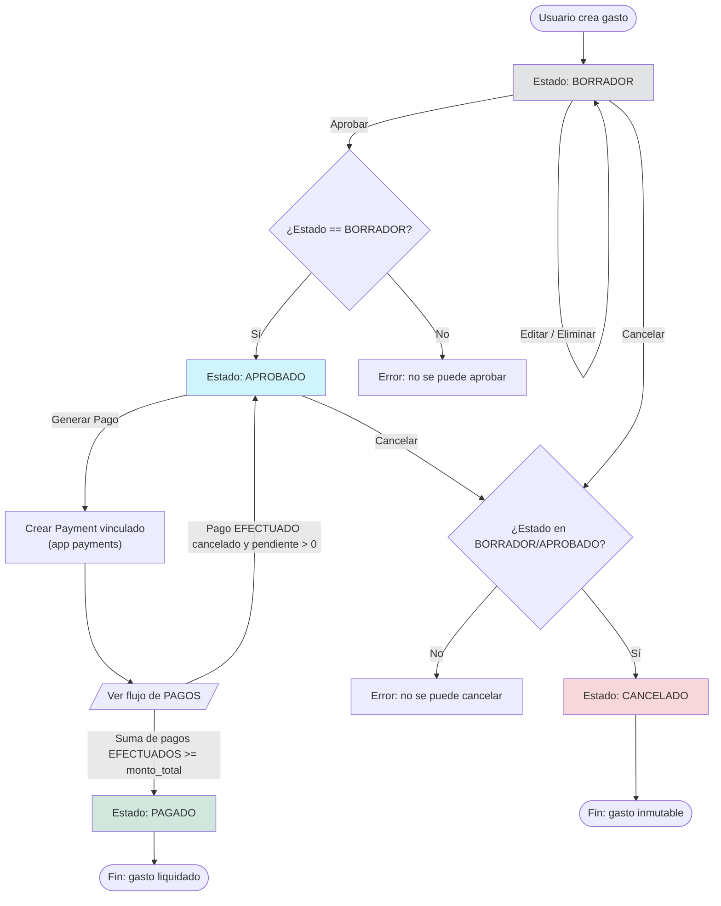
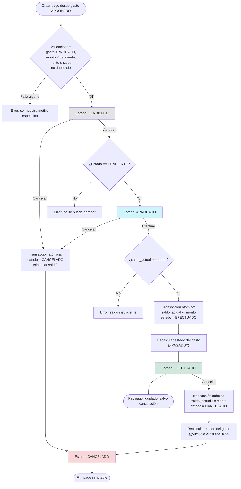

# Documento de Diseño

## Overview

**Expense Payment Manager** es una aplicación web monolítica construida sobre Django, con una interfaz de servidor renderizada con templates (Bootstrap 5 + Chart.js) y una API REST de solo lectura expuesta con Django REST Framework (DRF). El sistema gestiona tres entidades centrales — `BankAccount`, `Expense` y `Payment` — y dos flujos de aprobación (gastos y pagos) que están acoplados entre sí: los pagos solo pueden generarse contra gastos aprobados, y efectuar/cancelar un pago repercute en el saldo de la cuenta bancaria y, potencialmente, en el estado del gasto asociado.

Decisiones de diseño clave:

- **Thin views, fat services**: toda regla de negocio (transiciones de estado, validaciones cruzadas, operaciones atómicas sobre saldo) vive en módulos `services.py` por app. Las vistas solo orquestan: obtienen datos, llaman al servicio, capturan `ValidationError` y muestran mensajes.
- **Class-based views (CBVs)** de Django para el CRUD estándar (`ListView`, `DetailView`, `CreateView`, `UpdateView`, `DeleteView`), y **function-based views (FBVs)** simples para las acciones de transición de estado (`aprobar`, `cancelar`, `efectuar`, `generar_pago`), ya que estas últimas no encajan naturalmente en el patrón CBV y se benefician de una función corta y explícita.
- **Validación en el modelo (`clean()`)** para las reglas invariantes de datos (montos positivos, formato de cuenta), y **validación en la capa de servicio** para las reglas de transición de estado y las reglas que requieren consultar otras entidades (saldo, monto pendiente, duplicados). Esto evita que la lógica de negocio dependa únicamente de que el formulario llame `full_clean()`, y permite que la API y las vistas comparta exactamente la misma lógica.
- **DRF de solo lectura**: dado que el Requisito 9 solo pide endpoints GET, se usan `ReadOnlyModelViewSet` con `BasicAuthentication` + `IsAuthenticated`.

## Architecture

### Vista general del sistema



- El flujo de navegador usa vistas basadas en templates y `POST` de formularios estándar (sin JavaScript de framework, solo scripts puntuales para Chart.js y confirmaciones de modales Bootstrap).
- El flujo de API es independiente: no comparte vistas con el frontend, pero comparte los mismos modelos y, para agregaciones (dashboard), la misma función de servicio (`dashboard.services.get_summary()`), evitando duplicar lógica de cálculo.

### Estructura de carpetas

```
expense_payment_manager/
├── manage.py
├── requirements.txt
├── Procfile
├── build.sh
├── .env.example
├── config/                        # Proyecto Django (settings, urls raíz)
│   ├── __init__.py
│   ├── settings.py
│   ├── urls.py
│   ├── wsgi.py
│   └── asgi.py
│
├── accounts/                      # App: cuentas bancarias
│   ├── __init__.py
│   ├── apps.py
│   ├── models.py
│   ├── forms.py
│   ├── services.py
│   ├── views.py
│   ├── urls.py
│   ├── admin.py
│   ├── migrations/
│   ├── tests/
│   │   ├── test_models.py
│   │   ├── test_services.py
│   │   └── test_views.py
│   └── templates/accounts/
│       ├── bankaccount_list.html
│       ├── bankaccount_detail.html
│       └── bankaccount_form.html
│
├── expenses/                      # App: gastos
│   ├── __init__.py
│   ├── apps.py
│   ├── models.py
│   ├── forms.py
│   ├── services.py
│   ├── views.py
│   ├── urls.py
│   ├── admin.py
│   ├── migrations/
│   ├── tests/
│   │   ├── test_models.py
│   │   ├── test_services.py
│   │   └── test_views.py
│   └── templates/expenses/
│       ├── expense_list.html
│       ├── expense_detail.html
│       └── expense_form.html
│
├── payments/                      # App: pagos
│   ├── __init__.py
│   ├── apps.py
│   ├── models.py
│   ├── forms.py
│   ├── services.py
│   ├── views.py
│   ├── urls.py
│   ├── admin.py
│   ├── migrations/
│   ├── tests/
│   │   ├── test_models.py
│   │   ├── test_services.py
│   │   └── test_views.py
│   └── templates/payments/
│       ├── payment_list.html
│       ├── payment_detail.html
│       └── payment_form.html
│
├── dashboard/                     # App: dashboard (vista home + agregaciones)
│   ├── __init__.py
│   ├── apps.py
│   ├── services.py                # get_summary(), datos de gráficos
│   ├── views.py
│   ├── urls.py
│   ├── tests/
│   │   └── test_services.py
│   └── templates/dashboard/
│       └── home.html
│
├── api/                            # App: endpoints DRF
│   ├── __init__.py
│   ├── apps.py
│   ├── serializers.py
│   ├── views.py
│   ├── filters.py
│   ├── urls.py
│   └── tests/
│       └── test_api.py
│
└── templates/
    ├── base.html
    └── registration/
        └── login.html
```

> Nota: `dashboard` no aparece en el Requisito 10 como app obligatoria, pero se introduce como app propia (en lugar de vivir en `config`) para mantener la separación por dominio y porque el Requisito 8 la trata como una unidad funcional completa (vista + agregaciones). Esto no contradice el Requisito 10, que exige que `expenses`, `payments`, `accounts` y `api` existan como apps — `dashboard` es una app adicional, no un reemplazo.

## Components and Interfaces

### App `accounts`

| Componente | Responsabilidad |
|---|---|
| `models.BankAccount` | Definición del modelo y validación de campo (`clean()`). |
| `services.desactivar_cuenta(cuenta)` | Verifica que no existan pagos PENDIENTE/APROBADO antes de desactivar. |
| `views.BankAccountListView`, `DetailView`, `CreateView`, `UpdateView` | CRUD estándar. |
| `views.bankaccount_deactivate(request, pk)` | FBV que invoca `desactivar_cuenta` y maneja mensajes. |

### App `expenses`

| Componente | Responsabilidad |
|---|---|
| `models.Expense` | Definición del modelo, `clean()` para inmutabilidad de gastos CANCELADO, `monto_pendiente` (property). |
| `services.aprobar_gasto(expense, user)` | Transición BORRADOR → APROBADO. |
| `services.cancelar_gasto(expense, user)` | Transición BORRADOR/APROBADO → CANCELADO. |
| `services.recalcular_estado_pago(expense)` | Recalcula si el gasto debe pasar a PAGADO o volver a APROBADO según `monto_pendiente`. Invocado por `payments.services` tras efectuar/cancelar un pago. |
| `views.ExpenseListView`, `DetailView`, `CreateView`, `UpdateView`, `DeleteView` | CRUD estándar (CBV). |
| `views.expense_approve(request, pk)` | FBV, `POST` únicamente. |
| `views.expense_cancel(request, pk)` | FBV, `POST` únicamente. |
| `views.expense_generate_payment(request, pk)` | FBV `GET`, redirige a `payments:create` con `?expense_id=<pk>`. |

### App `payments`

| Componente | Responsabilidad |
|---|---|
| `models.Payment` | Definición del modelo, `clean()` para validaciones estructurales básicas (monto > 0). |
| `services.crear_pago(gasto, cuenta, monto, fecha, referencia, notas, user)` | Valida estado del gasto, monto ≤ pendiente, monto ≤ saldo, anti-duplicado; crea el `Payment` en PENDIENTE. |
| `services.aprobar_pago(payment)` | Transición PENDIENTE → APROBADO. |
| `services.efectuar_pago(payment)` | `transaction.atomic()`: valida saldo, descuenta saldo de `BankAccount`, transición → EFECTUADO, invoca `recalcular_estado_pago` del gasto. |
| `services.cancelar_pago(payment)` | `transaction.atomic()`: transición → CANCELADO; si estaba EFECTUADO, revierte saldo e invoca `recalcular_estado_pago`. |
| `views.PaymentListView`, `DetailView`, `CreateView`, `UpdateView`, `DeleteView` | CRUD estándar (CBV). `CreateView` lee `?expense_id=` de query params para pre-llenar. |
| `views.payment_approve/execute/cancel(request, pk)` | FBVs `POST`. |

### App `dashboard`

| Componente | Responsabilidad |
|---|---|
| `services.get_summary()` | Retorna `{total_gastos, total_pagado, total_pendiente, saldo_total_activo}`. |
| `services.get_top_n(queryset, n=10)` | Utilidad genérica: top-N ordenado por fecha descendente. |
| `services.get_expenses_by_status()` | Dict `{estado: count}` para el gráfico de dona. |
| `services.get_expenses_by_category()` | Dict `{categoria: monto_total}` para el gráfico de barras. |
| `services.get_payments_by_month(months=6)` | Lista de `{mes, total}` para el gráfico de línea. |
| `views.DashboardHomeView` | Ensambla todos los datos anteriores y renderiza `dashboard/home.html`. |

### App `api`

| Componente | Responsabilidad |
|---|---|
| `serializers.BankAccountSerializer` | Serializa todos los campos de `BankAccount`. |
| `serializers.ExpenseSerializer` | Serializa `Expense` + campo calculado `monto_pendiente` (`SerializerMethodField` o `ReadOnlyField(source='monto_pendiente')`). |
| `serializers.PaymentSerializer` | Serializa todos los campos de `Payment`. |
| `filters.EstadoFechaFilterMixin` / `ExpenseFilter`, `PaymentFilter` (django-filter) | Filtro por `estado` y `fecha` vía query params. |
| `views.ExpenseViewSet(ReadOnlyModelViewSet)` | `GET /api/expenses/`, `GET /api/expenses/{id}/`. |
| `views.PaymentViewSet(ReadOnlyModelViewSet)` | `GET /api/payments/`, `GET /api/payments/{id}/`. |
| `views.BankAccountViewSet(ReadOnlyModelViewSet)` | `GET /api/bank-accounts/`. |
| `views.dashboard_summary(request)` | `GET /api/dashboard/summary/`, reutiliza `dashboard.services.get_summary()`. |

### Vistas y URLs (routing completo)

```python
# expenses/urls.py
urlpatterns = [
    path("", ExpenseListView.as_view(), name="list"),
    path("nuevo/", ExpenseCreateView.as_view(), name="create"),
    path("<int:pk>/", ExpenseDetailView.as_view(), name="detail"),
    path("<int:pk>/editar/", ExpenseUpdateView.as_view(), name="update"),
    path("<int:pk>/eliminar/", ExpenseDeleteView.as_view(), name="delete"),
    path("<int:pk>/aprobar/", expense_approve, name="approve"),
    path("<int:pk>/cancelar/", expense_cancel, name="cancel"),
    path("<int:pk>/generar-pago/", expense_generate_payment, name="generate_payment"),
]

# payments/urls.py
urlpatterns = [
    path("", PaymentListView.as_view(), name="list"),
    path("nuevo/", PaymentCreateView.as_view(), name="create"),
    path("<int:pk>/", PaymentDetailView.as_view(), name="detail"),
    path("<int:pk>/editar/", PaymentUpdateView.as_view(), name="update"),
    path("<int:pk>/eliminar/", PaymentDeleteView.as_view(), name="delete"),
    path("<int:pk>/aprobar/", payment_approve, name="approve"),
    path("<int:pk>/efectuar/", payment_execute, name="execute"),
    path("<int:pk>/cancelar/", payment_cancel, name="cancel"),
]

# accounts/urls.py
urlpatterns = [
    path("", BankAccountListView.as_view(), name="list"),
    path("nuevo/", BankAccountCreateView.as_view(), name="create"),
    path("<int:pk>/", BankAccountDetailView.as_view(), name="detail"),
    path("<int:pk>/editar/", BankAccountUpdateView.as_view(), name="update"),
    path("<int:pk>/desactivar/", bankaccount_deactivate, name="deactivate"),
]

# dashboard/urls.py
urlpatterns = [
    path("", DashboardHomeView.as_view(), name="home"),
]

# api/urls.py
router = DefaultRouter()
router.register("expenses", ExpenseViewSet, basename="expense")
router.register("payments", PaymentViewSet, basename="payment")
router.register("bank-accounts", BankAccountViewSet, basename="bankaccount")
urlpatterns = [
    path("", include(router.urls)),
    path("dashboard/summary/", dashboard_summary, name="dashboard-summary"),
]

# config/urls.py
urlpatterns = [
    path("admin/", admin.site.urls),
    path("accounts/login/", auth_views.LoginView.as_view(template_name="registration/login.html"), name="login"),
    path("accounts/logout/", auth_views.LogoutView.as_view(), name="logout"),
    path("gastos/", include("expenses.urls")),
    path("pagos/", include("payments.urls")),
    path("cuentas/", include("accounts.urls")),
    path("api/", include("api.urls")),
    path("", include("dashboard.urls")),
]
```

> Nota de nombres: la app `accounts` (cuentas bancarias) no debe confundirse con `django.contrib.auth` — las rutas de login/logout built-in de Django se registran directamente en `config/urls.py` bajo el prefijo `accounts/login` por convención de Django, mientras que las rutas de la app `accounts` (cuentas bancarias) se registran bajo el prefijo `cuentas/` para evitar colisión.

## Data Models

### `accounts.models.BankAccount`

```python
class BankAccount(models.Model):
    class Moneda(models.TextChoices):
        USD = "USD", "Dólares"
        MXN = "MXN", "Pesos Mexicanos"
        EUR = "EUR", "Euros"

    nombre = models.CharField(max_length=100)
    banco = models.CharField(max_length=100)
    numero_cuenta = models.CharField(
        max_length=4,
        validators=[RegexValidator(r"^\d{4}$", "Deben ser 4 dígitos numéricos.")],
        help_text="Últimos 4 dígitos de la cuenta.",
    )
    saldo_actual = models.DecimalField(max_digits=12, decimal_places=2, validators=[MinValueValidator(0)])
    moneda = models.CharField(max_length=3, choices=Moneda.choices, default=Moneda.USD)
    activa = models.BooleanField(default=True)
    creado_en = models.DateTimeField(auto_now_add=True)
    actualizado_en = models.DateTimeField(auto_now=True)

    class Meta:
        ordering = ["nombre"]

    def __str__(self):
        return f"{self.nombre} ({self.banco} ****{self.numero_cuenta})"

    def clean(self):
        if self.saldo_actual is not None and self.saldo_actual < 0:
            raise ValidationError({"saldo_actual": "El saldo no puede ser negativo."})
```

### `expenses.models.Expense`

```python
class Expense(models.Model):
    class Categoria(models.TextChoices):
        VIATICOS = "VIATICOS", "Viáticos"
        SUMINISTROS = "SUMINISTROS", "Suministros"
        SERVICIOS = "SERVICIOS", "Servicios"
        NOMINA = "NOMINA", "Nómina"
        MARKETING = "MARKETING", "Marketing"
        OTROS = "OTROS", "Otros"

    class Estado(models.TextChoices):
        BORRADOR = "BORRADOR", "Borrador"
        APROBADO = "APROBADO", "Aprobado"
        PAGADO = "PAGADO", "Pagado"
        CANCELADO = "CANCELADO", "Cancelado"

    titulo = models.CharField(max_length=150)
    descripcion = models.TextField(blank=True)
    monto_total = models.DecimalField(max_digits=12, decimal_places=2, validators=[MinValueValidator(Decimal("0.01"))])
    categoria = models.CharField(max_length=20, choices=Categoria.choices)
    fecha = models.DateField()
    estado = models.CharField(max_length=20, choices=Estado.choices, default=Estado.BORRADOR)
    creado_por = models.ForeignKey(settings.AUTH_USER_MODEL, on_delete=models.PROTECT, related_name="gastos_creados")
    creado_en = models.DateTimeField(auto_now_add=True)
    actualizado_en = models.DateTimeField(auto_now=True)

    class Meta:
        ordering = ["-fecha"]

    def __str__(self):
        return f"{self.titulo} ({self.get_estado_display()})"

    @property
    def monto_pendiente(self) -> Decimal:
        """monto_total menos la suma de pagos EFECTUADOS asociados."""
        pagado = self.pagos.filter(estado=Payment.Estado.EFECTUADO).aggregate(
            total=Sum("monto")
        )["total"] or Decimal("0.00")
        return self.monto_total - pagado

    def clean(self):
        if self.pk:
            estado_previo = Expense.objects.filter(pk=self.pk).values_list("estado", flat=True).first()
            if estado_previo == self.Estado.CANCELADO and self.estado != self.Estado.CANCELADO:
                raise ValidationError("Un gasto CANCELADO no puede cambiar de estado.")
            if estado_previo in (self.Estado.APROBADO, self.Estado.PAGADO, self.Estado.CANCELADO):
                # Los campos de contenido solo son editables en BORRADOR;
                # las transiciones de estado se hacen vía servicios, no vía este check.
                pass
```

### `payments.models.Payment`

```python
class Payment(models.Model):
    class Estado(models.TextChoices):
        PENDIENTE = "PENDIENTE", "Pendiente"
        APROBADO = "APROBADO", "Aprobado"
        EFECTUADO = "EFECTUADO", "Efectuado"
        CANCELADO = "CANCELADO", "Cancelado"

    gasto = models.ForeignKey("expenses.Expense", on_delete=models.PROTECT, related_name="pagos")
    cuenta_bancaria = models.ForeignKey("accounts.BankAccount", on_delete=models.PROTECT, related_name="pagos")
    monto = models.DecimalField(max_digits=12, decimal_places=2, validators=[MinValueValidator(Decimal("0.01"))])
    fecha = models.DateField()
    estado = models.CharField(max_length=20, choices=Estado.choices, default=Estado.PENDIENTE)
    referencia = models.CharField(max_length=100, blank=True)
    notas = models.TextField(blank=True)
    creado_por = models.ForeignKey(settings.AUTH_USER_MODEL, on_delete=models.PROTECT, related_name="pagos_creados")
    creado_en = models.DateTimeField(auto_now_add=True)
    actualizado_en = models.DateTimeField(auto_now=True)

    class Meta:
        ordering = ["-fecha"]

    def __str__(self):
        return f"Pago {self.pk} - {self.gasto.titulo} ({self.get_estado_display()})"

    def clean(self):
        if self.monto is not None and self.monto <= 0:
            raise ValidationError({"monto": "El monto debe ser mayor a cero."})
```

> Las reglas que requieren consultar *otras* entidades (gasto aprobado, monto ≤ pendiente, monto ≤ saldo, anti-duplicado) se implementan en `payments.services.crear_pago`, no en `Payment.clean()`, porque `clean()` de Django no tiene acceso natural a "esto es una creación nueva vs. edición" ni al contexto de la operación (por ejemplo, permitir editar un pago PENDIENTE sin volver a chequear duplicado contra sí mismo). Centralizar esto en la capa de servicio evita duplicar la misma lógica de validación entre el modelo y la vista, y mantiene un único punto de verdad reutilizable también por la API si en el futuro se agregan endpoints de escritura.

### Validaciones de negocio (resumen por regla)

| Regla | Dónde se aplica | Excepción usada |
|---|---|---|
| Gasto debe estar APROBADO antes de crear pago | `payments.services.crear_pago` | `ValidationError` |
| Monto de pago ≤ `monto_pendiente` del gasto | `payments.services.crear_pago` | `ValidationError` |
| Monto de pago ≤ `saldo_actual` de la cuenta | `payments.services.crear_pago` y `efectuar_pago` | `ValidationError` |
| Anti-duplicado (gasto, cuenta, monto, fecha) | `payments.services.crear_pago` | `ValidationError` |
| Gasto CANCELADO es inmutable | `expenses.models.Expense.clean()` + `expenses.services.*` | `ValidationError` |
| Transiciones de estado válidas (gasto y pago) | `expenses.services.*`, `payments.services.*` | `ValidationError` |

## Database Diagram (ERD)



## Process Flow Diagrams

### Flujo de proceso de GASTOS



### Flujo de proceso de PAGOS



## Correctness Properties

*A property is a characteristic or behavior that should hold true across all valid executions of a system — essentially, a formal statement about what the system should do. Properties serve as the bridge between human-readable specifications and machine-verifiable correctness guarantees.*

Las properties siguientes se centran en la capa de servicios (`services.py`) de cada app, que contiene toda la lógica de negocio pura (transiciones de estado, cálculos de montos, agregaciones), dejando fuera de esta sección las pruebas de renderizado de UI, autenticación estándar de Django y configuración/estructura de proyecto, que se cubren como ejemplos, integración o smoke tests en la Testing Strategy.

### Property 1: Un gasto recién creado siempre inicia en BORRADOR

Para cualquier conjunto de datos válidos de gasto (título, monto positivo, categoría válida, fecha), crear un `Expense` SHALL resultar en un registro con `estado == BORRADOR`.

**Validates: Requirements 2.1**

### Property 2: El monto pendiente es el monto total menos los pagos efectuados

Para cualquier gasto y cualquier conjunto de pagos asociados con estados y montos arbitrarios, `expense.monto_pendiente` SHALL ser igual a `monto_total` menos la suma de los montos de los pagos en estado EFECTUADO, y nunca SHALL contar pagos en otro estado.

**Validates: Requirements 2.3**

### Property 3: Solo los gastos en BORRADOR son editables

Para cualquier gasto y cualquier estado, intentar editar el gasto SHALL tener éxito si y solo si el estado del gasto es BORRADOR; para cualquier otro estado, la edición SHALL ser rechazada sin modificar el gasto.

**Validates: Requirements 2.4, 2.5**

### Property 4: Solo los gastos en BORRADOR son eliminables

Para cualquier gasto y cualquier estado, intentar eliminar el gasto SHALL tener éxito si y solo si el estado del gasto es BORRADOR; para cualquier otro estado, la eliminación SHALL ser rechazada y el gasto SHALL seguir existiendo.

**Validates: Requirements 2.6, 2.7**

### Property 5: Aprobar un gasto solo tiene éxito desde BORRADOR

Para cualquier gasto en cualquier estado, `aprobar_gasto` SHALL cambiar el estado a APROBADO si y solo si el estado inicial era BORRADOR; para cualquier otro estado inicial, SHALL lanzar `ValidationError` y el estado SHALL permanecer sin cambios.

**Validates: Requirements 3.1, 3.2, 3.3**

### Property 6: Cancelar un gasto solo tiene éxito desde BORRADOR o APROBADO

Para cualquier gasto en cualquier estado, `cancelar_gasto` SHALL cambiar el estado a CANCELADO si y solo si el estado inicial era BORRADOR o APROBADO; para PAGADO o CANCELADO, SHALL lanzar `ValidationError` y el estado SHALL permanecer sin cambios.

**Validates: Requirements 3.5, 3.6**

### Property 7: Un gasto CANCELADO es un estado terminal

Para cualquier gasto en estado CANCELADO y cualquier operación de transición (`aprobar_gasto`, `cancelar_gasto`, o el recálculo automático disparado por pagos), el estado del gasto SHALL permanecer CANCELADO después de la operación.

**Validates: Requirements 3.7**

### Property 8: La suma de pagos efectuados dispara el estado PAGADO

Para cualquier gasto y cualquier secuencia de pagos que se efectúan sobre él, en el momento en que la suma de los montos de los pagos EFECTUADOS alcanza o supera `monto_total`, el estado del gasto SHALL cambiar automáticamente a PAGADO.

**Validates: Requirements 3.8**

### Property 9: Un pago recién creado siempre inicia en PENDIENTE

Para cualquier conjunto de datos válidos de pago que pasen todas las validaciones de creación, `crear_pago` SHALL resultar en un registro con `estado == PENDIENTE`.

**Validates: Requirements 4.1**

### Property 10: Crear un pago requiere que el gasto esté APROBADO

Para cualquier gasto en cualquier estado y cualquier monto válido, `crear_pago` SHALL tener éxito solo si el estado del gasto es APROBADO; para cualquier otro estado, SHALL rechazar la creación con `ValidationError` y no SHALL crear ningún registro `Payment`.

**Validates: Requirements 4.2**

### Property 11: El monto de un pago no puede exceder el monto pendiente del gasto

Para cualquier gasto APROBADO y cualquier monto propuesto, `crear_pago` SHALL rechazar la creación si el monto excede `monto_pendiente` del gasto, y SHALL permitirla si el monto es menor o igual.

**Validates: Requirements 4.3**

### Property 12: El monto de un pago no puede exceder el saldo de la cuenta

Para cualquier cuenta bancaria y cualquier monto propuesto, `crear_pago` SHALL rechazar la creación si el monto excede `saldo_actual` de la cuenta, y SHALL permitirla si el monto es menor o igual (asumiendo que las demás validaciones se cumplen).

**Validates: Requirements 4.4**

### Property 13: No se permiten pagos duplicados

Para cualquier par de intentos de creación de pago con el mismo gasto, la misma cuenta bancaria, el mismo monto y la misma fecha, `crear_pago` SHALL permitir el primero y SHALL rechazar el segundo con `ValidationError`.

**Validates: Requirements 4.5**

### Property 14: Solo los pagos en PENDIENTE son editables

Para cualquier pago y cualquier estado, intentar editar el pago SHALL tener éxito si y solo si el estado del pago es PENDIENTE; para cualquier otro estado, la edición SHALL ser rechazada sin modificar el pago.

**Validates: Requirements 4.8, 4.9**

### Property 15: Aprobar un pago solo tiene éxito desde PENDIENTE

Para cualquier pago en cualquier estado, `aprobar_pago` SHALL cambiar el estado a APROBADO si y solo si el estado inicial era PENDIENTE; para cualquier otro estado, SHALL lanzar `ValidationError` y el estado SHALL permanecer sin cambios.

**Validates: Requirements 5.1, 5.2**

### Property 16: Efectuar un pago es consistente con el saldo de la cuenta

Para cualquier pago APROBADO y cualquier saldo de cuenta, `efectuar_pago` SHALL tener éxito y descontar exactamente `monto` del `saldo_actual` de la cuenta si y solo si `saldo_actual >= monto`; si `saldo_actual < monto`, SHALL rechazar la operación con `ValidationError` y el saldo SHALL permanecer sin cambios.

**Validates: Requirements 5.3, 5.4, 5.5**

### Property 17: Cancelar un pago revierte el saldo solo si estaba EFECTUADO

Para cualquier pago en estado EFECTUADO, `cancelar_pago` SHALL restaurar el `saldo_actual` de la cuenta a su valor previo a la ejecución del pago (`saldo_actual + monto`); para cualquier pago en estado PENDIENTE o APROBADO, `cancelar_pago` SHALL cambiar el estado a CANCELADO sin modificar el `saldo_actual` de ninguna cuenta.

**Validates: Requirements 5.7, 5.8**

### Property 18: Cancelar un pago efectuado reevalúa el estado del gasto

Para cualquier gasto en estado PAGADO cuyo pago EFECTUADO asociado se cancela, si el `monto_pendiente` resultante es mayor a cero, el estado del gasto SHALL volver a APROBADO.

**Validates: Requirements 5.9**

### Property 19: El monto sugerido al generar un pago es el monto pendiente

Para cualquier gasto APROBADO con cualquier historial de pagos, el monto inicial sugerido en el formulario de creación de pago pre-llenado desde ese gasto SHALL ser exactamente igual a `monto_pendiente` del gasto en el momento de la solicitud.

**Validates: Requirements 6.3**

### Property 20: Editar una cuenta bancaria nunca modifica el saldo

Para cualquier cuenta bancaria y cualquier intento de edición que incluya un valor distinto para `saldo_actual`, el formulario de edición SHALL ignorar ese valor y `saldo_actual` SHALL permanecer sin cambios después de guardar.

**Validates: Requirements 7.3**

### Property 21: Una cuenta solo se desactiva si no tiene pagos activos

Para cualquier cuenta bancaria y cualquier conjunto de pagos asociados, `desactivar_cuenta` SHALL tener éxito si y solo si no existe ningún pago en estado PENDIENTE o APROBADO asociado a esa cuenta; en caso de rechazo, el mensaje de error SHALL reportar exactamente el número de pagos activos encontrados.

**Validates: Requirements 7.4, 7.5**

### Property 22: Las tarjetas de resumen del dashboard son agregaciones exactas

Para cualquier conjunto de gastos, pagos y cuentas bancarias, `get_summary()` SHALL devolver: `total_gastos` igual a la suma de `monto_total` de todos los gastos, `total_pagado` igual a la suma de `monto` de los pagos EFECTUADOS, `total_pendiente` igual a la suma de `monto_pendiente` de todos los gastos, y `saldo_total_activo` igual a la suma de `saldo_actual` de las cuentas con `activa == True`.

**Validates: Requirements 8.1, 9.7**

### Property 23: Las listas "últimos N" están limitadas y ordenadas

Para cualquier colección de gastos o de pagos, `get_top_n(queryset, n)` SHALL devolver como máximo `n` elementos, y SHALL devolverlos ordenados por `fecha` de forma estrictamente descendente (o igual, en caso de fechas repetidas).

**Validates: Requirements 8.2, 8.3**

### Property 24: Los datos de agregación de gráficos suman al total

Para cualquier conjunto de gastos, la suma de los conteos devueltos por `get_expenses_by_status()` SHALL ser igual al número total de gastos, y la suma de los montos devueltos por `get_expenses_by_category()` SHALL ser igual a la suma de `monto_total` de todos los gastos.

**Validates: Requirements 8.4, 8.5**

### Property 25: Los pagos mensuales agregados no exceden el total efectuado

Para cualquier conjunto de pagos, la suma de los totales mensuales devueltos por `get_payments_by_month(6)` SHALL ser menor o igual a la suma total de montos de pagos EFECTUADOS (igual cuando todos los pagos EFECTUADOS caen dentro de la ventana de 6 meses).

**Validates: Requirements 8.6**

### Property 26: El serializer de gastos expone el monto pendiente correctamente

Para cualquier gasto con cualquier historial de pagos, el campo `monto_pendiente` en `ExpenseSerializer` SHALL coincidir exactamente con la property `monto_pendiente` del modelo, y todos los demás campos del modelo SHALL estar presentes en la representación serializada.

**Validates: Requirements 9.2, 9.3**

### Property 27: El serializer de pagos expone todos los campos fielmente

Para cualquier pago, todos los campos del modelo `Payment` SHALL estar presentes en la representación serializada por `PaymentSerializer` con valores idénticos a los del modelo.

**Validates: Requirements 9.4, 9.5**

### Property 28: El serializer de cuentas bancarias expone todos los campos fielmente

Para cualquier cuenta bancaria, todos los campos del modelo `BankAccount` SHALL estar presentes en la representación serializada por `BankAccountSerializer` con valores idénticos a los del modelo.

**Validates: Requirements 9.6**

### Property 29: El filtrado por campo devuelve únicamente coincidencias exactas

Para cualquier valor de `estado` o `fecha` usado como parámetro de filtro en los endpoints de la API, todos los elementos devueltos SHALL tener ese valor exacto en el campo correspondiente, y ningún elemento con un valor distinto SHALL aparecer en el resultado.

**Validates: Requirements 9.8, 9.9**

## Error Handling

- **Errores de validación de negocio**: toda función de `services.py` que rechace una operación SHALL lanzar `django.core.exceptions.ValidationError` con un mensaje descriptivo (incluyendo, cuando aplique, el valor límite relevante: monto máximo permitido, saldo disponible, número de pagos activos). Las vistas capturan esta excepción en un bloque `try/except` alrededor de la llamada al servicio y usan `django.contrib.messages.error(request, str(e))` antes de redirigir de vuelta a la página de origen (típicamente el detalle del objeto).
- **Errores de formulario**: los `ModelForm` de Django (`ExpenseForm`, `PaymentForm`, `BankAccountForm`) validan formato de campos (obligatoriedad, tipos, `RegexValidator` de `numero_cuenta`) antes de que la vista llegue a invocar el servicio; los errores se muestran inline junto a cada campo mediante el renderizado estándar de Bootstrap 5 (`{{ form.campo.errors }}`).
- **Mensajes de éxito**: cada transición exitosa (aprobar, cancelar, efectuar) usa `messages.success(request, ...)` con un texto claro (p. ej. "Gasto aprobado correctamente.").
- **Objetos no encontrados**: las `DetailView`/`UpdateView`/`DeleteView` de Django manejan automáticamente `Http404` cuando el `pk` no existe, mostrando la página 404 estándar de Django (personalizable vía `templates/404.html` si se desea, aunque no es un requisito obligatorio).
- **Errores de la API**: `ReadOnlyModelViewSet` de DRF devuelve automáticamente `404` para IDs inexistentes y `401` para solicitudes sin autenticación válida (gestionado por `BasicAuthentication` + `IsAuthenticated` en `DEFAULT_PERMISSION_CLASSES`), ambos en formato JSON estándar de DRF (`{"detail": "..."}`).
- **Errores no controlados**: `settings.DEBUG = False` en producción asegura que cualquier excepción no capturada muestre la página 500 genérica de Django en lugar de un traceback, evitando filtrar información sensible.

## Testing Strategy

El proyecto usa **pytest** + **pytest-django** como test runner (más expresivo que `unittest`/`TestCase` para property-based testing) y **Hypothesis** como librería de property-based testing para Python (no se implementa PBT desde cero).

**Enfoque dual**:
- **Unit tests / example tests**: cubren casos concretos de éxito, casos borde de validación de formularios (campos vacíos, monto negativo, formato de `numero_cuenta`), comportamiento estándar de Django (login/logout, permisos de acceso, autenticación de la API, respuestas 404/401) y renderizado de templates (presencia de badges de color, visibilidad condicional de botones).
- **Property-based tests**: cubren las 29 properties definidas arriba, todas ubicadas en la capa de servicios y en las funciones puras de agregación/serialización, usando `hypothesis` para generar gastos, pagos, cuentas, montos y fechas aleatorios.

**Configuración de Hypothesis**:
- Cada test de property SHALL usar `@settings(max_examples=100)` (mínimo 100 iteraciones) de Hypothesis.
- Cada test de property SHALL estar anotado con un comentario o docstring en el formato:
  `# Feature: expense-payment-manager, Property {number}: {property_text}`
- Cada property del diseño SHALL implementarse con un único test de Hypothesis (`@given(...)` con una función de test dedicada).
- Los datos de prueba se generan con estrategias personalizadas (`st.builds`, `st.decimals`, `st.dates`) combinadas con `pytest-django`'s `db` fixture y `factory_boy` (opcional) para crear instancias de modelo válidas de forma eficiente.

**Ubicación de los tests**: cada app contiene su propio paquete `tests/` con `test_models.py` (validación de modelo), `test_services.py` (lógica de negocio — aquí viven las properties) y `test_views.py` (comportamiento HTTP: status codes, redirecciones, mensajes, permisos). La app `api` contiene `test_api.py` para las properties de serialización y filtrado (Properties 26-29), y `dashboard` contiene `test_services.py` para las properties de agregación (Properties 22-25).

**Fuera de alcance para PBT** (cubierto por ejemplos/integración/smoke, según Error Handling y prework):
- Autenticación estándar de Django (login/logout, `login_required`) — comportamiento de biblioteca, no varía con datos de negocio.
- Renderizado visual (colores de badges, visibilidad de botones, modales de confirmación) — se cubre con tests de ejemplo que verifican presencia de clases CSS/HTML esperadas en el contexto o respuesta renderizada.
- Autenticación de la API (`BasicAuthentication`, respuesta 401 sin credenciales) — comportamiento de DRF ya probado por la librería.
- Configuración de entorno (variables de entorno, selección SQLite/PostgreSQL, admin por defecto) — se cubre con un smoke test único que verifica que `settings.DATABASES` cambia según `DJANGO_ENV`.

Ejemplo de estructura de un test de property (ilustrativo, Property 16):

```python
# payments/tests/test_services.py
from decimal import Decimal
from hypothesis import given, settings, strategies as st
import pytest
from payments.services import efectuar_pago
from django.core.exceptions import ValidationError

# Feature: expense-payment-manager, Property 16: Efectuar un pago es consistente
# con el saldo de la cuenta: saldo_actual >= monto SHALL implicar éxito y descuento
# exacto; saldo_actual < monto SHALL implicar rechazo sin cambios.
@pytest.mark.django_db
@given(
    saldo=st.decimals(min_value="0.00", max_value="100000.00", places=2),
    monto=st.decimals(min_value="0.01", max_value="100000.00", places=2),
)
@settings(max_examples=100)
def test_efectuar_pago_consistente_con_saldo(saldo, monto, cuenta_factory, pago_aprobado_factory):
    cuenta = cuenta_factory(saldo_actual=saldo)
    pago = pago_aprobado_factory(cuenta_bancaria=cuenta, monto=monto)

    if saldo >= monto:
        efectuar_pago(pago)
        cuenta.refresh_from_db()
        assert cuenta.saldo_actual == saldo - monto
        assert pago.estado == pago.Estado.EFECTUADO
    else:
        with pytest.raises(ValidationError):
            efectuar_pago(pago)
        cuenta.refresh_from_db()
        assert cuenta.saldo_actual == saldo
```
